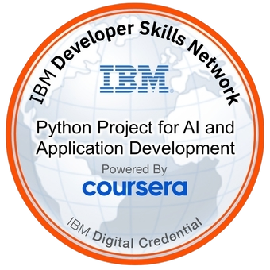
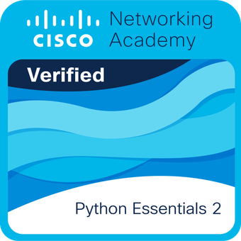
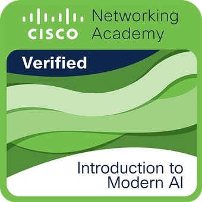
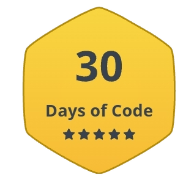
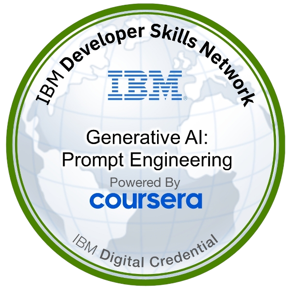
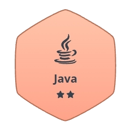

<!-- Credits to Saviru/GitBanner for banner generation -->

  

# 💫 About Me
21 year old Full-Stack Agentic Al Automation Developer based in the Philippines, pursuing my Bachelor's degree in Computer Science while interning as a Backend Al Engineer at Flyrank Al.
A Python enthusiast, solving everyday coding challenges. Technical expertise backed by professional certifications in Google's UI/UX Design, IBM's Al Development, and n8n professional workflow automation.

 

# 💻 Tech Stack

### ⚡ Languages

### 🎨 Frontend & Mobile Development

### ⚙️ Backend & Frameworks

### 🗄️ Databases & Cloud Hosting

### 🛠️ DevOps, Build Tools & Environment

### 🖌️ Design & Productivity

 

# 📊 GitHub Stats

  <picture>
    <source
      media="(prefers-color-scheme: dark)"
      srcset="https://github-readme-stats.shion.dev/api/top-langs/?username=SeanRDC&theme=dark&hide_border=true&include_all_commits=true&count_private=true&layout=compact"
    />
    <source
      media="(prefers-color-scheme: light)"
      srcset="https://github-readme-stats.shion.dev/api/top-langs/?username=SeanRDC&theme=default&hide_border=true&include_all_commits=true&count_private=true&layout=compact"
    />
    
  </picture>

  <picture>
    <source
      media="(prefers-color-scheme: dark)"
      srcset="https://streak-stats.demolab.com?user=SeanRDC&theme=dark&hide_border=true"
    />
    <source
      media="(prefers-color-scheme: light)"
      srcset="https://streak-stats.demolab.com?user=SeanRDC&theme=default&hide_border=true"
    />
    
  </picture>

# 🎖️ Selected Badges

&nbsp;&nbsp;
&nbsp;&nbsp;
&nbsp;&nbsp;
&nbsp;&nbsp;
&nbsp;&nbsp;
&nbsp;&nbsp;
&nbsp;&nbsp;
&nbsp;&nbsp;
&nbsp;&nbsp;
&nbsp;&nbsp;
&nbsp;&nbsp;

